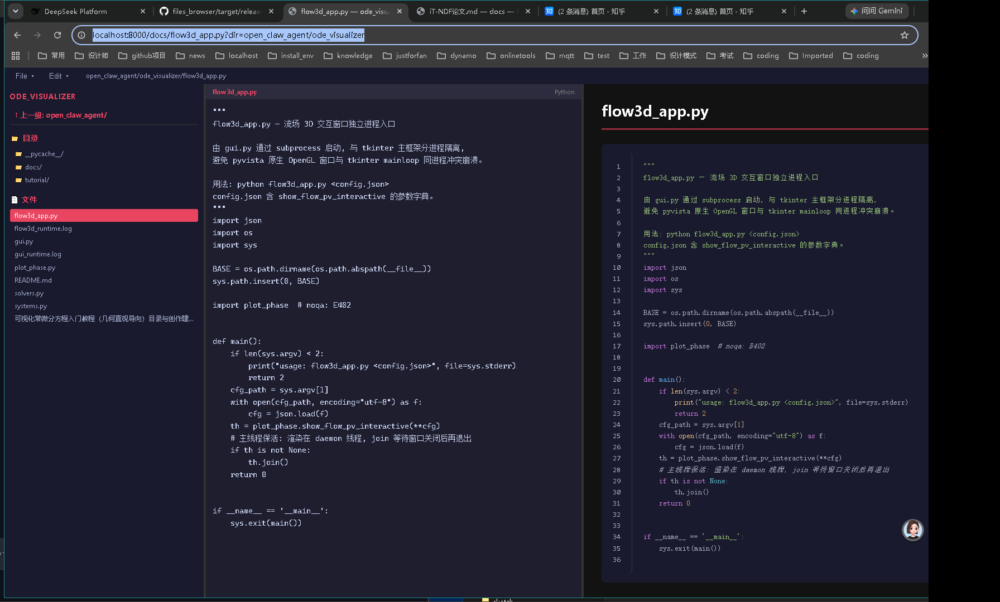

# files_browser

Rust 编写的轻量级 Markdown / 文件浏览器与在线编辑器。单二进制、无外部依赖，内置完整的前端渲染资产（KaTeX 数学公式、Mermaid 图表、highlight.js 代码高亮、html2pdf PDF 导出）。



## 功能特性

- 📄 **Markdown 渲染**：表格、脚注、删除线、任务列表（pulldown-cmark）
- 🧮 **LaTeX 数学公式**：KaTeX 渲染（行内 `$...$` 与块级 `$$...$$`）
- 📊 **Mermaid 图表**：流程图/时序图/甘特图等
- 🎨 **代码高亮**：highlight.js，atom-one-dark 主题
- 📑 **PDF → HTML 渲染**：内置 PDF 内容流解释器（lopdf）
- 🧱 **```html 代码块直通**：围栏标注 html 的代码块**原样注入为真实 HTML**（而非转义进 `<pre><code>`），可在 Markdown 里嵌自定义卡片/SVG/表格
- 📓 **ipynb / TeX 渲染**
- ✏️ **在线编辑**：新建 / 保存 / 查找 / 替换 / 撤销重做
- 📥 **PDF 导出**：html2pdf.js 本地导出
- 🗂️ **目录浏览**：左侧目录树、字母排序、面包屑导航
- 🌐 **纯本地**：所有前端资产内置，无需 CDN/互联网

## 快速开始

### Windows

```bat
start_files_browser.bat
```

### 命令行

```bash
# files_browser [port] [root_dir] [base_path]
files_browser 8899 ./docs
files_browser 8000 D:\my_project /docs    # 反向代理场景
```

| 参数 | 默认值 | 说明 |
|:-----|:------:|:-----|
| `port` | `8899` | 服务端口 |
| `root_dir` | `./docs` | 服务根目录 |
| `base_path` | 空 | URL 前缀，如 `/docs` |

启动后浏览器访问 `http://localhost:8899`。

## 使用说明

### 浏览文件

左侧目录树列出服务根目录下所有文件（目录在前，按字母排序）：

- 点击 `.md` → Markdown 渲染（含 KaTeX 公式、Mermaid 图）
- 点击 `.py` / `.rs` / `.toml` 等 → 语法高亮
- 点击 `.ipynb` → Notebook 渲染
- 点击 `.tex` → LaTeX 渲染
- 点击 `.pdf` → PDF 预览
- `↑ 上一级` → 返回上级目录
- URL 参数 `?dir=xxx` → 浏览指定子目录（如 `?dir=open_claw_agent/ode_visualizer`）

### 编辑文件

| 操作 | 方法 |
|------|------|
| 新建 | `File → New...`，输入文件名 + 扩展名 |
| 保存 | `File → Save` 或 `Ctrl+S` |
| 查找 | `Edit → Find` 或 `Ctrl+F` |
| 替换 | `Edit → Replace` 或 `Ctrl+H`（逐个/全部） |
| 撤销/重做 | `Ctrl+Z` / `Ctrl+Y` |

### 导出 PDF

`File → Export PDF` — 将当前渲染页面导出为 PDF。

## HTTP API

| 端点 | 用途 |
|------|------|
| `GET /api/raw?file=x.md` | 读文本文件 |
| `GET /api/raw_bin?file=x.pdf` | 读二进制文件 |
| `POST /api/save` | 保存文件 `{dir, filename, content}` |
| `POST /api/new` | 新建文件 `{dir, filename, ext}` |
| `POST /api/render` | 渲染 md/ipynb/tex 为 HTML |

## 反向代理（Caddy 示例）

```caddyfile
localhost:8000 {
    uri strip_prefix /docs
    reverse_proxy localhost:8899
}
```

访问 `http://localhost:8000/docs/任意路径` 即浏览服务根目录。

## 技术栈

- Rust（std TCP server，无 Web 框架）
- [pulldown-cmark](https://crates.io/crates/pulldown-cmark) — Markdown 解析
- [lopdf](https://crates.io/crates/lopdf) — PDF 解析
- KaTeX / Mermaid / highlight.js / html2pdf.js — 前端渲染（本地内置，无 CDN 依赖）

## 构建

```bash
cargo build --release
# 产物: target/release/files_browser.exe
```

## 许可

MIT
