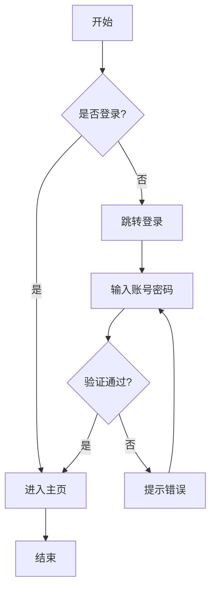
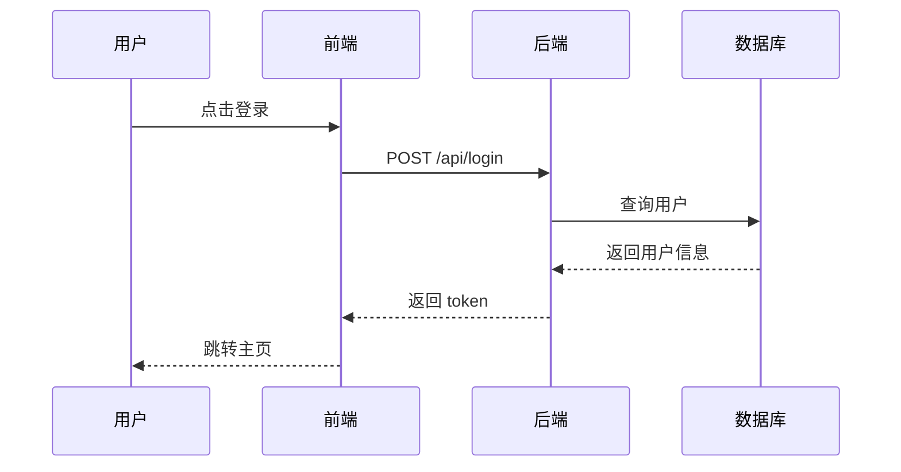
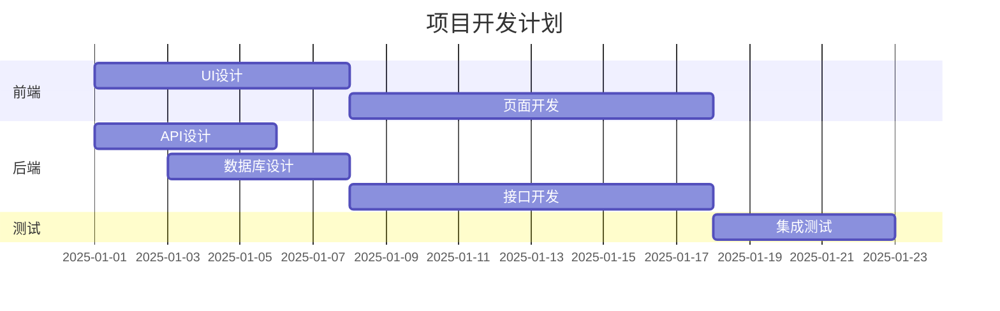
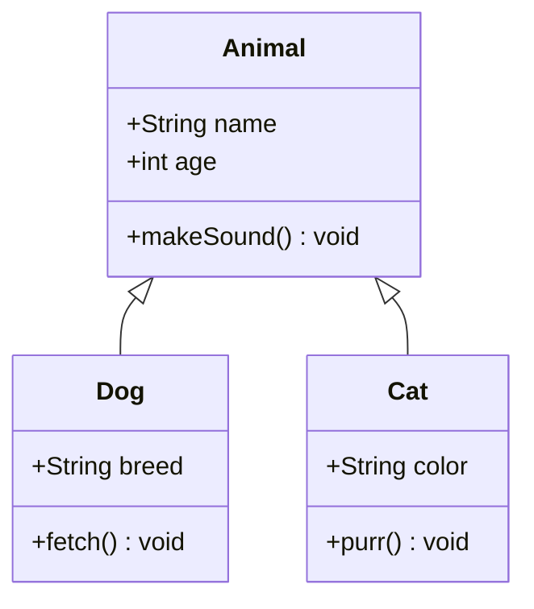

# Mermaid 渲染测试

## 流程图 (Flowchart)

```mermaid
graph TD
    A[开始] --> B{是否登录?}
    B -->|是| C[进入主页]
    B -->|否| D[跳转登录]
    D --> E[输入账号密码]
    E --> F{验证通过?}
    F -->|是| C
    F -->|否| G[提示错误]
    G --> E
    C --> H[结束]
```

## 时序图 (Sequence Diagram)

```mermaid
sequenceDiagram
    participant U as 用户
    participant F as 前端
    participant B as 后端
    participant D as 数据库
    
    U->>F: 点击登录
    F->>B: POST /api/login
    B->>D: 查询用户
    D-->>B: 返回用户信息
    B-->>F: 返回 token
    F-->>U: 跳转主页
```

## 甘特图 (Gantt)

```mermaid
gantt
    title 项目开发计划
    dateFormat  YYYY-MM-DD
    section 前端
    UI设计           :a1, 2025-01-01, 7d
    页面开发         :a2, after a1, 10d
    section 后端
    API设计          :b1, 2025-01-01, 5d
    数据库设计       :b2, 2025-01-03, 5d
    接口开发         :b3, after b2, 10d
    section 测试
    集成测试         :c1, after a2 b3, 5d
```

## 类图 (Class Diagram)

```mermaid
classDiagram
    class Animal {
        +String name
        +int age
        +makeSound() void
    }
    class Dog {
        +String breed
        +fetch() void
    }
    class Cat {
        +String color
        +purr() void
    }
    Animal <|-- Dog
    Animal <|-- Cat
```

---

> 以上图表均由 Mermaid.js 客户端渲染。
